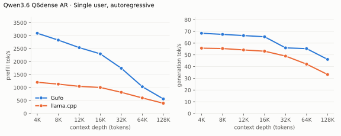
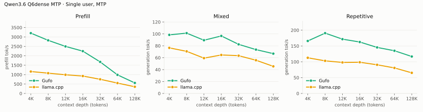
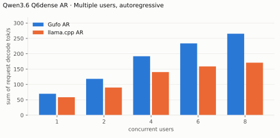
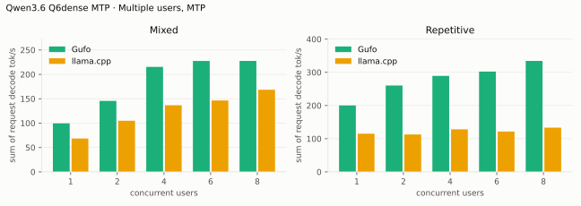
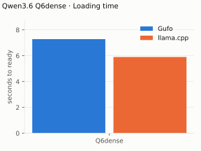
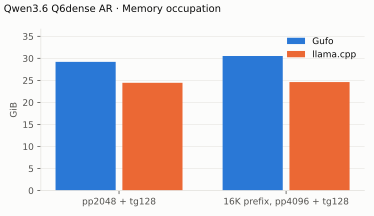

# Qwen3.6-35B-A3B benchmarks

AMD Strix Halo `gfx1151`, 128 GB unified memory. Q6dense GGUF with its native
MTP block; Gufo uses adaptive MTP. HTTP, greedy, thinking off. llama.cpp
`b11069` for AR and MTP (`--spec-type draft-mtp`, same file). Measured
October 3, 2026. The host also runs an unrelated GPU service, so single
samples carry a few percent of noise; the two 12,288 rows that deviated were
measured again.

Positive gain favors Gufo.
[Quality and measurement details](QUALITY.md#benchmark-method) · [Model identities](artifacts/model-identities.json)

## Single user, autoregressive

pp2048 / tg128; depth is the cached prefix in tokens.

<!-- bench:single-ar -->
| Qwen3.6 Q6dense AR Depth (tokens) | Gufo pp (tok/s) | llama.cpp pp (tok/s) | Gain | Gufo tg (tok/s) | llama.cpp tg (tok/s) | Gain |
| ---: | ---: | ---: | ---: | ---: | ---: | ---: |
| 4,096 | 3095.44 | 1203.09 | +157.3% | 68.43 | 55.69 | +22.9% |
| 8,192 | 2830.00 | 1133.07 | +149.8% | 67.45 | 55.40 | +21.8% |
| 12,288 | 2539.36 | 1046.51 | +142.7% | 66.45 | 54.20 | +22.6% |
| 16,384 | 2299.49 | 1003.51 | +129.1% | 65.43 | 53.10 | +23.2% |
| 32,768 | 1743.92 | 816.27 | +113.6% | 55.95 | 48.95 | +14.3% |
| 65,536 | 1032.64 | 598.99 | +72.4% | 55.31 | 42.08 | +31.4% |
| 131,072 | 561.21 | 394.52 | +42.3% | 46.14 | 33.24 | +38.8% |
<!-- /bench -->

## Single user, MTP

pp is the highest measured rate per engine and depth across mixed/repetitive
text.

<!-- bench:single-mtp -->
| Qwen3.6 Q6dense MTP Depth (tokens) | Gufo pp (tok/s) | llama.cpp pp (tok/s) | Gain pp | Gufo tg mixed (tok/s) | llama.cpp tg mixed (tok/s) | Gain mixed | Gufo tg repetitive (tok/s) | llama.cpp tg repetitive (tok/s) | Gain repetitive |
| ---: | ---: | ---: | ---: | ---: | ---: | ---: | ---: | ---: | ---: |
| 4,096 | 3204.41 | 1164.47 | +175.2% | 98.36 | 76.55 | +28.5% | 165.90 | 112.70 | +47.2% |
| 8,192 | 2821.10 | 1078.48 | +161.6% | 101.29 | 70.71 | +43.2% | 190.67 | 103.08 | +85.0% |
| 12,288 | 2498.99 | 992.82 | +151.7% | 89.36 | 59.31 | +50.7% | 171.62 | 98.04 | +75.1% |
| 16,384 | 2247.17 | 925.30 | +142.9% | 96.56 | 64.63 | +49.4% | 162.58 | 98.61 | +64.9% |
| 32,768 | 1676.17 | 752.78 | +122.7% | 82.44 | 63.44 | +29.9% | 145.50 | 90.62 | +60.6% |
| 65,536 | 987.59 | 550.63 | +79.4% | 73.61 | 55.79 | +31.9% | 134.97 | 80.72 | +67.2% |
| 131,072 | 559.15 | 356.00 | +57.1% | 66.85 | 45.52 | +46.9% | 116.77 | 65.15 | +79.2% |
<!-- /bench -->

## Multiple users, autoregressive

pp2048 prose prompt with no cached prefix, tg128, context 4096 per user.
Prefill every session before timed decoding; sum individual request decode rates.

<!-- bench:multi-ar -->
| Qwen3.6 Q6dense AR Users | Gufo AR (tok/s) | llama.cpp AR (tok/s) | Gain |
| ---: | ---: | ---: | ---: |
| 1 | 69.74 | 58.29 | +19.6% |
| 2 | 118.33 | 89.95 | +31.6% |
| 4 | 191.83 | 140.33 | +36.7% |
| 6 | 233.62 | 158.75 | +47.2% |
| 8 | 265.18 | 170.89 | +55.2% |
<!-- /bench -->

## Multiple users, MTP

pp2048 mixed/repetitive prompts with no cached prefix, tg128. Prefill every
session before timed decoding.
On mixed text at C6/C8 the batch controller verifies few drafts, and Gufo
MTP falls below its own AR rate (227.56 versus 265.18 tok/s at C8).

<!-- bench:multi-mtp -->
| Qwen3.6 Q6dense MTP Users | Gufo mixed (tok/s) | llama.cpp mixed (tok/s) | Gain | Gufo repetitive (tok/s) | llama.cpp repetitive (tok/s) | Gain |
| ---: | ---: | ---: | ---: | ---: | ---: | ---: |
| 1 | 99.58 | 68.44 | +45.5% | 200.28 | 115.20 | +73.9% |
| 2 | 145.53 | 104.91 | +38.7% | 260.25 | 112.77 | +130.8% |
| 4 | 215.37 | 136.67 | +57.6% | 289.22 | 128.29 | +125.4% |
| 6 | 227.49 | 146.42 | +55.4% | 302.25 | 121.67 | +148.4% |
| 8 | 227.56 | 168.53 | +35.0% | 334.35 | 133.29 | +150.8% |
<!-- /bench -->

## Loading time

C1, capacity 262144, MTP. Cold model file to HTTP readiness. Gufo also
builds Q8_0 prefill copies of the Q6_K matrices and regroups Q6_K decode rows
while loading.

<!-- bench:loading -->
| Qwen3.6 Q6dense Target | Gufo ready (s) | llama.cpp ready (s) | Gain |
| --- | ---: | ---: | ---: |
| Q6dense | 7.28 | 5.90 | -19.0% |
<!-- /bench -->

## Memory occupation

C1, AR, capacity 133121. llama-server preallocates its KV cache, so its
footprint does not grow with the prefix. Gufo's extra memory is the Q8_0
prefill copies of the Q6_K matrices and the 8-bit K/V decode copy.

<!-- bench:memory -->
| Qwen3.6 Q6dense AR Workload | Gufo GiB | llama.cpp GiB | Gain |
| --- | ---: | ---: | ---: |
| pp2048 + tg128 | 29.20 | 24.45 | -16.3% |
| 16K prefix, pp4096 + tg128 | 30.53 | 24.62 | -19.4% |
<!-- /bench -->

